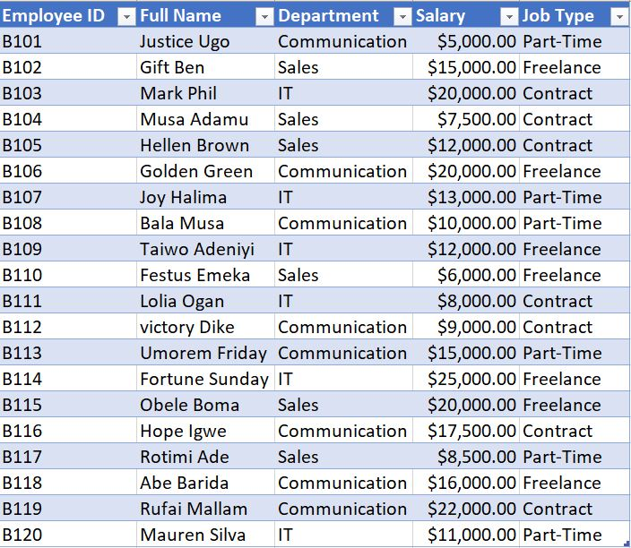
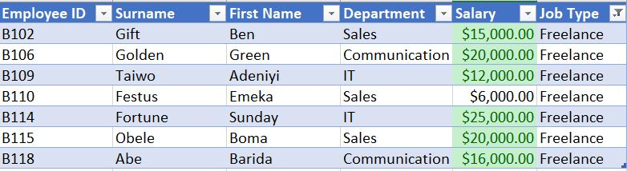
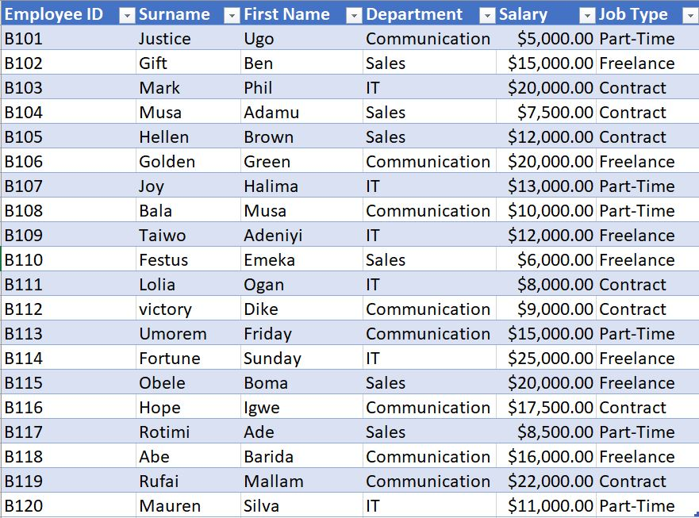
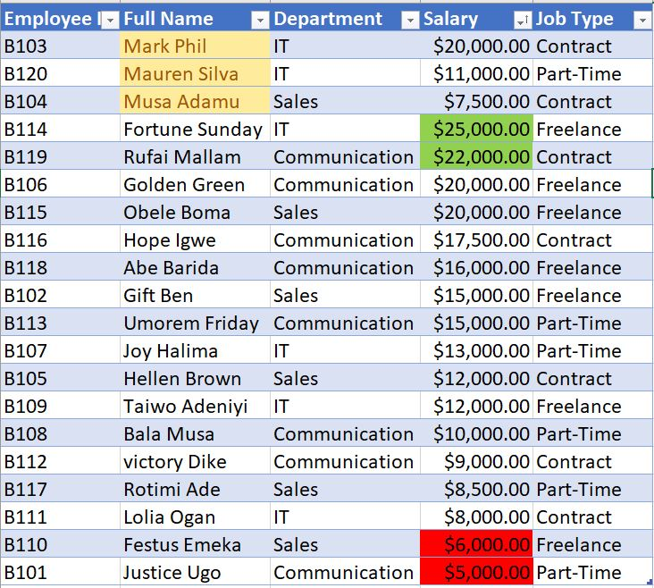

# My-first-Excel-project
## Introduction
This is a small employee data set of 20 persons used to kick start my journey into data analyis with microsoft excel.
## first aim  
- **clean** the data, which includes removing **blank** cells, removing **duplicate** data and **spelling** check
- column **formatting** to match the type of data in the cells
- Put data in a table
## Cleaned Data

## Task 1
In worksheet 1, Show only employees who are ‘Freelancers’ and highlight the ones whose salaries are above $10000
## Solution
- Filter job column to leave only freelancers using the sort and filter tool in the editing ribbon in home tab
- Next, highlight the salary column from filterd data, and use the conditional formatting in the home tab.Use the _**highlight cell rules**_ option

## Task 2
In worksheet 2, split the employees’ full names into first name and last name. Check for duplicates and highlight if any (do not delete)
## Solution
- Highlight the name column, go to data tab, under data tools ribbon, then use the text to column tool. Flash fill tool can also be used

## Task 3
In worksheet 3, highlight employees whose names begin with the letter ‘M’ (in yellow). Format the Salary column such that the highest SALARY has a green background and the lowest SALARY has a red background
## Solution
- Highlight name column, go to **conditional formatting** using  **Highlight cell rules**. Click on 'more rules' select '**specific text**', select '**begin with**', then type letter **M** then choose color
- Do similar to the salary column, but use '**Top/bottom**' rule

